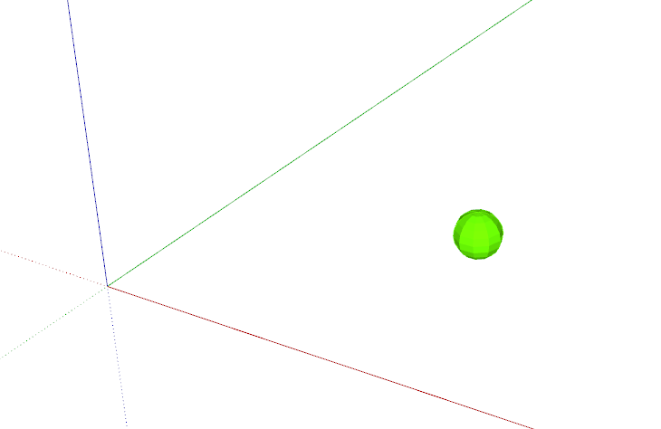
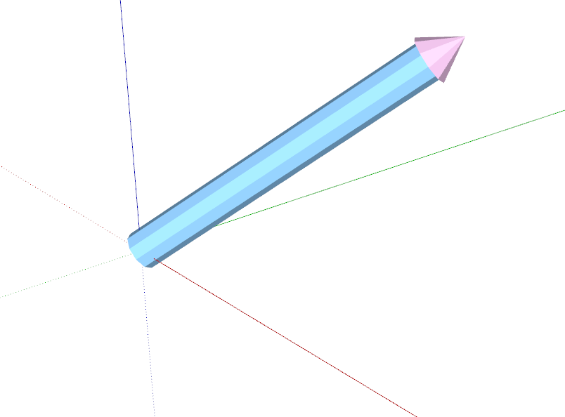

# 第三章 几何

## 工具箱

代码链接：<a href="https://github.com/elonzyy/course-skp19/blob/master/plugin-src/op_course_helpers/visualization/pt_and_vec.rb" target="_blank">op_course_helpers/visualization/pt_and_vec.rb</a>

### 可视化 Geom::Point3d



```ruby
CourseHelpers.visualize_pt(Geom::Point3d.new([1.m, 1.m, 0]))
```

### 可视化 Geom::Vector3d



```ruby
CourseHelpers.visualize_vec(Geom::Vector3d.new([1.m, 1.m, 1.m]))
```
