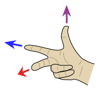

## 笛卡尔坐标系、点

### 笛卡尔坐标系
  * 红(X)、绿(Y)、蓝(Z)
  * 互相垂直
  * 交于原点

#### 右手定则
  

### 创建Point3d

```ruby
[2.m, 1.m, 0]
```

```ruby
Geom::Point3d.new(2.m, 1.m, 0)
```

### 原点常量

```ruby
ORIGIN
```

### 判断位置相同

```ruby
Geom::Point3d.new(2.m, 1.m, 0) == [2.m, 1.m, 0]
```

### Ruby语言运算符是方法

```ruby
'string1'.eql?('string2')
'string1'.==('string2')
'string1' == 'string2'
```

### 点与点的距离

#### 公式


#### distance

```ruby
ORIGIN.distance(Geom::Point3d.new(2.m, 1.m, 0))
```

### API
|关键字|描述|文档链接|
|---|---|---|
|Point3d|点类型|<a href="http://ruby.sketchup.com/Geom/Point3d.html" target="_blank">doc</a>
|ORIGIN|原点常量|<a href="http://ruby.sketchup.com/top-level-namespace.html#constant_summary" target="_blank">doc</a>
|point3d.x|获取x分量|<a href="http://ruby.sketchup.com/Geom/Point3d.html#x-instance_method" target="_blank">doc</a>
|point3d.y|获取y分量|<a href="http://ruby.sketchup.com/Geom/Point3d.html#y-instance_method" target="_blank">doc</a>
|point3d.z|获取z分量|<a href="http://ruby.sketchup.com/Geom/Point3d.html#z-instance_method" target="_blank">doc</a>
|array.x|获取数组第一个元素|<a href="http://ruby.sketchup.com/Array.html#x-instance_method" target="_blank">doc</a>
|array.y|获取数组第二个元素|<a href="http://ruby.sketchup.com/Array.html#y-instance_method" target="_blank">doc</a>
|array.z|获取数组第三个元素|<a href="http://ruby.sketchup.com/Array.html#z-instance_method" target="_blank">doc</a>
|point3d.==|判断位置是否相同|<a href="http://ruby.sketchup.com/Geom/Point3d.html#==-instance_method" target="_blank">doc</a>
|distance|两点之间距离|<a href="http://ruby.sketchup.com/Geom/Point3d.html#distance-instance_method" target="_blank">doc</a>
