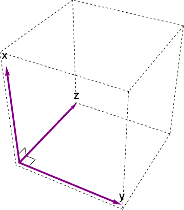
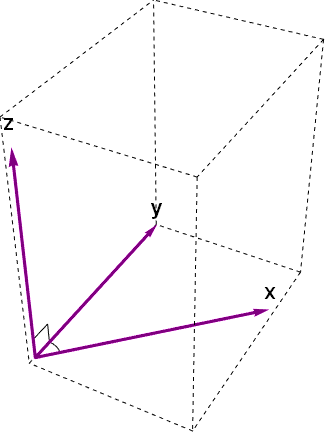

## 练习题

1. **使用 is_a? 判断以下命题是否正确：**
  * 0.2 是 Float
  * -10 是 Integer
  * Float::INFINITY 是 Numeric
  * 'text' 是 Numeric 
  * nil 是 Object

2. **小明在美国开车行驶速度为 80km/h，路边交通表示显示限速为 50(miles/h) 请问小明是否超速。**

3. **多选：下列坐标系哪些是符合右手定则的笛卡尔坐标系(右手坐标系)？**
  <figure class="image">
    
    <figcaption>A</figcaption>
  </figure>
  <figure class="image">
    
    <figcaption>B</figcaption>
  </figure>
  <figure class="image">
    
    <figcaption>C</figcaption>
  </figure>
  <figure class="image">
    
    <figcaption>D</figcaption>
  </figure>
